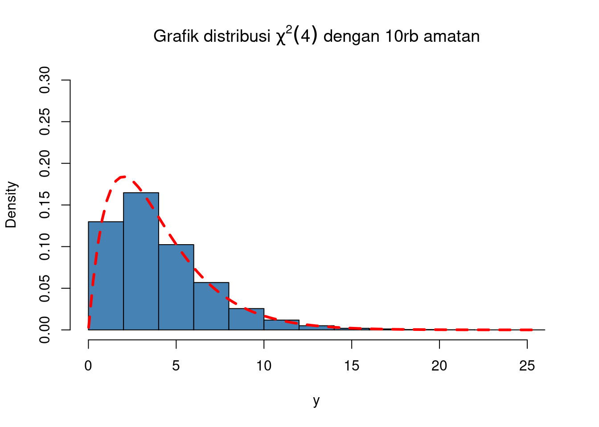

# (PART) Cookbook: Blogdown sites {-}


# Introduction {-#intro-blogdown}

Overview- this is a section filled with recipes for making common types of educational content...

# Make a site {#make-blogdown}


```r
set.seed(12)
y <- rchisq(10000,df=4)
hist(y,freq=FALSE,ylim=c(0,0.3),
     main=expression(paste("Grafik distribusi ",
                           chi^2,(4)," dengan 10rb amatan" ))
     ,col="steelblue")
curve(expr=dchisq(x,df=4),from = min(y),to = max(y),col="red",lty=2,lwd=3,add=TRUE)
```




# Make a site for a workshop

# Make a site for a course

# Make it fancier
