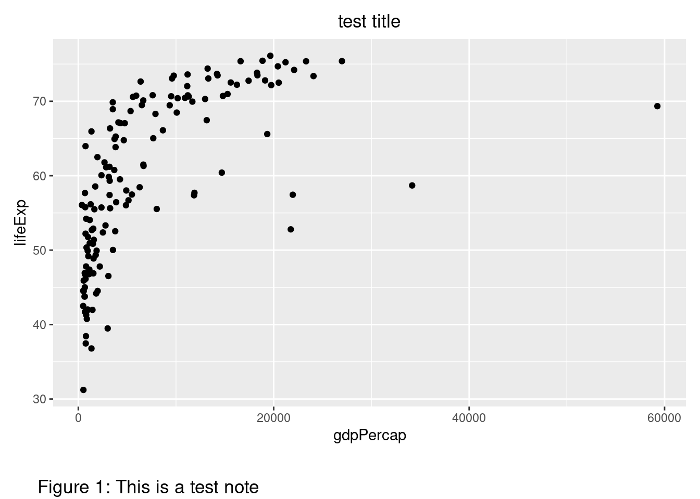
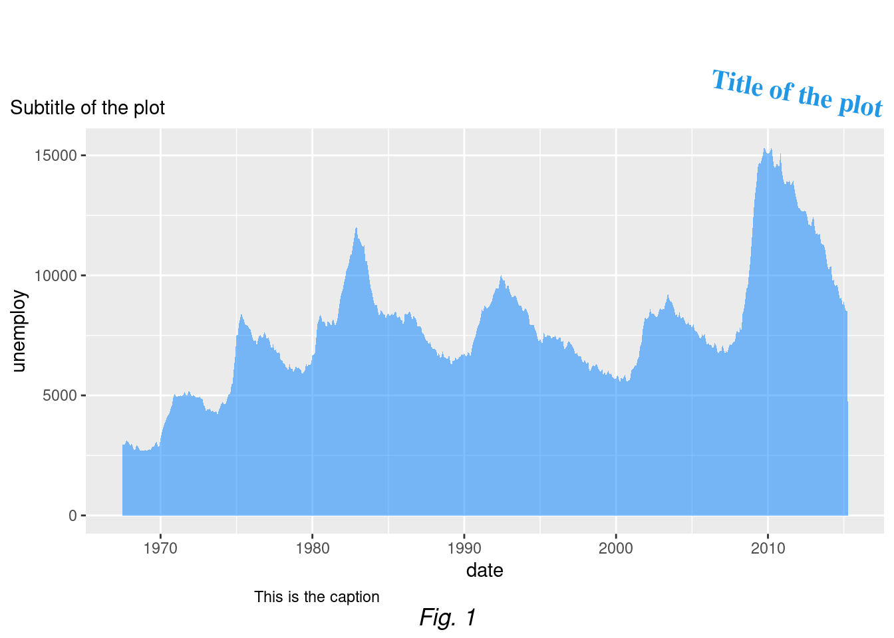

# (PART) Cookbook: Blogdown sites {-}


# Introduction {-#intro-blogdown}

Overview- this is a section filled with recipes for making common types of educational content...

# Make a site {#make-blogdown}


```r
set.seed(12)
y <- rchisq(10000,df=4)
hist(y,freq=FALSE,ylim=c(0,0.3),
     main=expression(paste("Grafik distribusi ",
                           chi^2,(4)," dengan 10rb amatan" ))
     ,col="steelblue")
curve(expr=dchisq(x,df=4),from = min(y),to = max(y),col="red",lty=2,lwd=3,add=TRUE)
```


# Make a site for a workshop

```r
library(ggplot2)
library(gapminder)
data(gapminder, package = 'gapminder')

ggplot(subset(gapminder, year %in% 1977), aes(gdpPercap, lifeExp)) +
    geom_point() + 
    labs(title = "test title",
         tag = "Figure 1: This is a test note") +
    coord_cartesian(clip = "off") +
    theme(plot.title = element_text(hjust = 0.5),
          plot.margin = margin(t = 10, r = 10, b = 40, l = 10),
          plot.tag.position = c(0.2, -0.1)
          )
```




# Make a site for a course

```r
# install.packages(ggplot2)
library(ggplot2)

ggplot(economics, aes(date, unemploy)) +
  geom_area(fill = rgb(0, 0.5, 1, alpha = 0.5)) + 
  labs(title = "Title of the plot",
       subtitle = "Subtitle of the plot",
       caption = "This is the caption",
       tag = "Fig. 1") + 
  theme(plot.title = element_text(family = "serif",              # Font family
                                  face = "bold",                 # Font face
                                  color = 4,                     # Font color
                                  size = 15,                     # Font size
                                  hjust = 1,                     # Horizontal adjustment
                                  vjust = 1,                     # Vertical adjustment
                                  angle = -10,                   # Font angle
                                  lineheight = 1,                # Line spacing
                                  margin = margin(20, 0, 0, 0)), # Margins (t, r, b, l)
        plot.subtitle = element_text(hjust = 0),    # Subtitle customization
        plot.caption = element_text(hjust = 0.25),  # Caption customization
        plot.tag = element_text(face = "italic"),   # Tag customization
        plot.title.position = "plot",               # Title and subtitle position ("plot" or "panel")
        plot.caption.position = "panel",            # Caption position ("plot" or "panel")
        plot.tag.position = "bottom")                  # Tag position 
```




# Make it fancier
