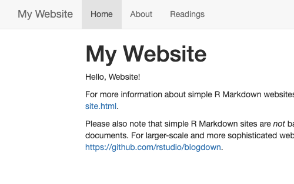
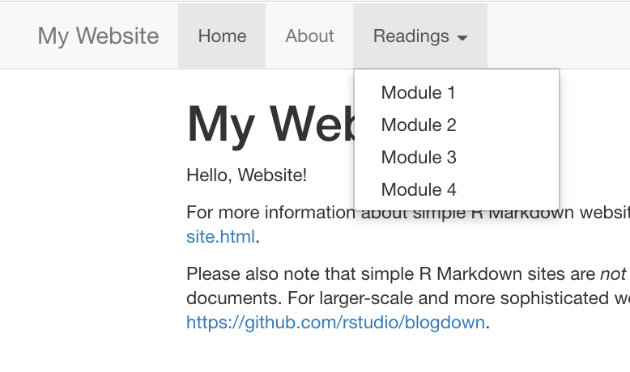

# Make it yours {#rmd-yours}


## Adding new pages {#add-rmd}

Adding new pages to your site means adding new `.Rmd` files to your site's project root directory. You can do this in RStudio using *File > New File > R Markdown*. Delete the default YAML except for the title and all text/code in the document, then edit away.

## Grow your navbar {#rmd-grow}

To make a new page actually findable from your site, you'll need to *also* make a change to navbar, which means opening up the `_site.yml` file and fiddling with it. To add another R Markdown link to your navbar, you need to know two things about the new page you want to add:

1. The **name you want to see** on the navbar for this page; this is the page's `text`.

1. The **name of the `.html` file** that corresponds to the `.Rmd` file you're adding; this is the page's `href`

Let's say we create a new file called `readings.Rmd`. We want to add the link to the rendered page `readingss.html` to our upper navbar next to "Home" and "About", so we would add the following to our YAML:

```yaml
navbar:
  left:
  - text: Home
    href: index.html
  - text: About
    href: about.html
  - text: Readings
    href: readings.html
```

\

Save the changes to `_site.yml`, build, and preview to see the new page appear in the upper navbar.

<div class = side-by-side>
<div class = side1>

```yaml
name: My Website
output_dir: docs
navbar:
  left:
  - text: Home
    href: index.html
  - text: About
    href: about.html
  - text: Readings
    href: readings.html
```

</div>

<div class= side2>


</div>
</div>

You may have noticed that in the YAML options we’ve looked at so far, `left:` has been one of the first things to go under `navbar:`. You can add all (or just some) of your links aligned to the right side of the navbar instead by using `right:`. 

```yaml
navbar:
  left: []
  right: []
```

\

If we added the page for `rmd.Rmd` to the right of our navbar instead:
<div class = side-by-side>
<div class = side1>

```yaml
name: My Website
output_dir: docs
navbar:
  left:
  - text: Home
    href: index.html
  - text: Lectures
    href: lectures.html
  right:
  - text: Readings
    href: readings.html
```

</div>

  <div class= side2>

    
  </div>
</div>


## Add a dropdown menu {#rmd-menu}

At some point, you may realize that you need room to grow with your navbar and the content you have planned to create and share. When you do, you may want to use dropdown menus. You can create a dropdown menu to add *many* more pages to the site without taking up space in your navbar. Let's say we had a course with several modules, and we decided to create a separate R Markdown document for each module of readings in this course. We could create a dropdown menu called "Readings" and link to each of the readings pages underneath that. 

See how we do this in the YAML below:

1. We'll start by getting rid of the single `readings.Rmd` that we linked in our navbar. 
1. **Add a new `- text:` field** followed by the heading that you want to use for your dropdown. I'm going to call mine "Readings". 
1. **Add** a `menu:` field. Nothing else goes on this line.
1. Now **add** the pages that will go under this menu with their own `- text:` and `href:` fields. 
1. **Repeat** the previous step until you've added all the pages for this dropdown. We're adding 4 new pages under our menu.


<div class = side-by-side>
<div class = side1>

```yaml
navbar:
  title: My Website
  left:
  - text: Home
    href: index.html
  - text: About
    href: about.html
  - text: Readings
    menu:
    - text: Module 1
      href: readings-module1.html
    - text: Module 2
      href: readings-module2.html
    - text: Module 3
      href: readings-module3.html
    - text: Module 4
      href: readings-module4.html
```


</div>

<div class= side2>


</div>
</div>

## Add your content
Now that you know how to add and link new pages to your site, you're ready to make your site your own with your own content. 

Creating this for a workshop? A course? Need ideas of what to include? Check out our [Organization]() page.

## Recap

In this section you: 

* Added new pages
* Grew your navbar
* Added a dropdown menu
* Added your own content to your site

